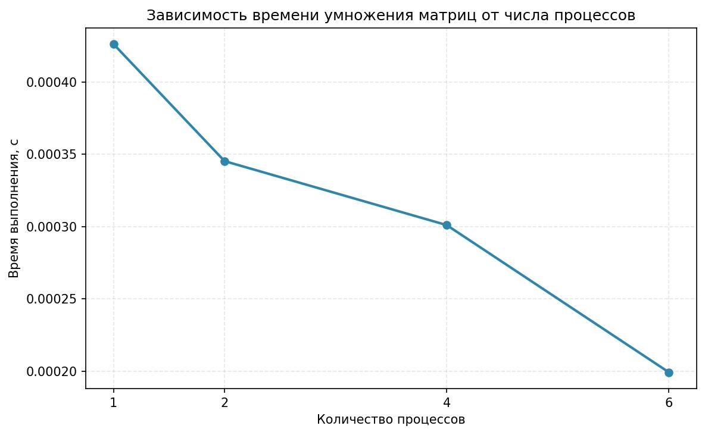
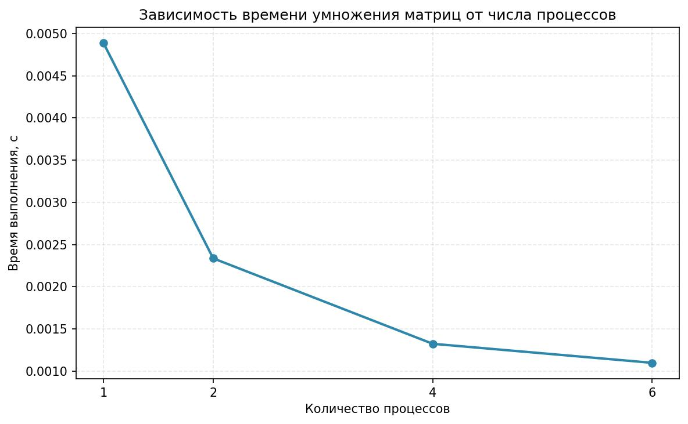
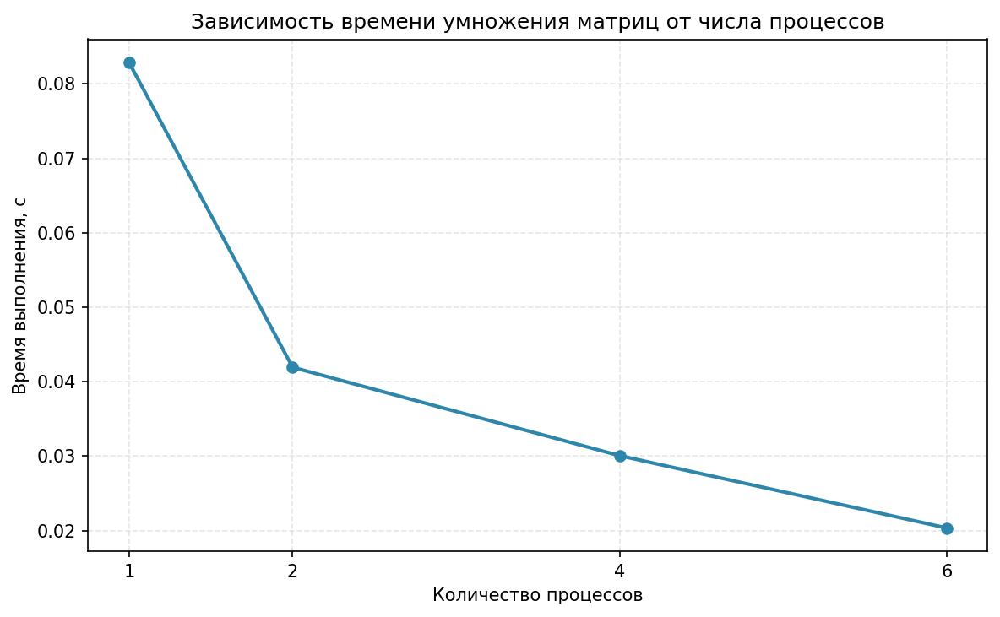
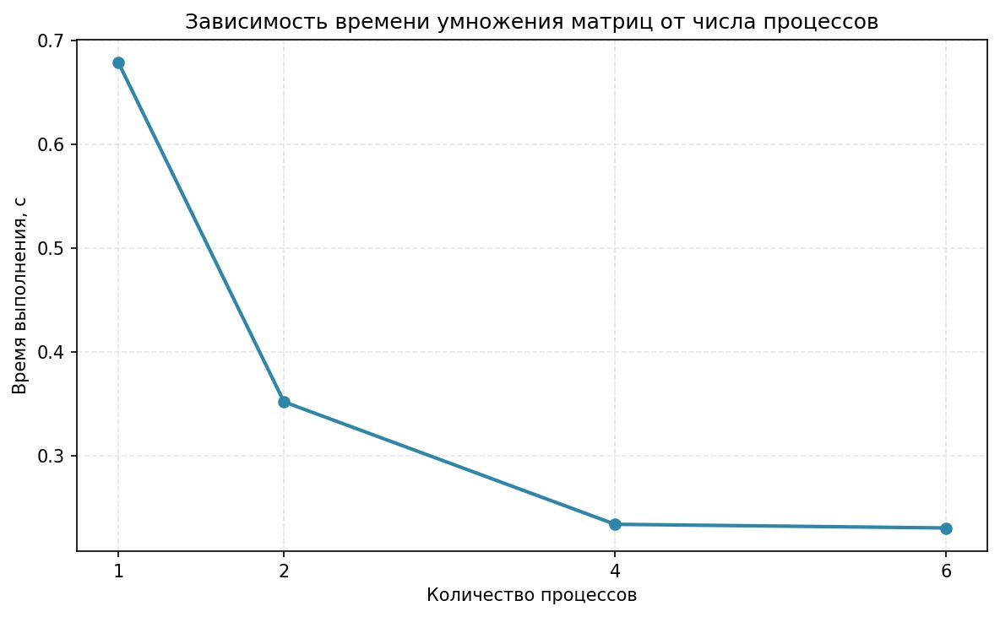
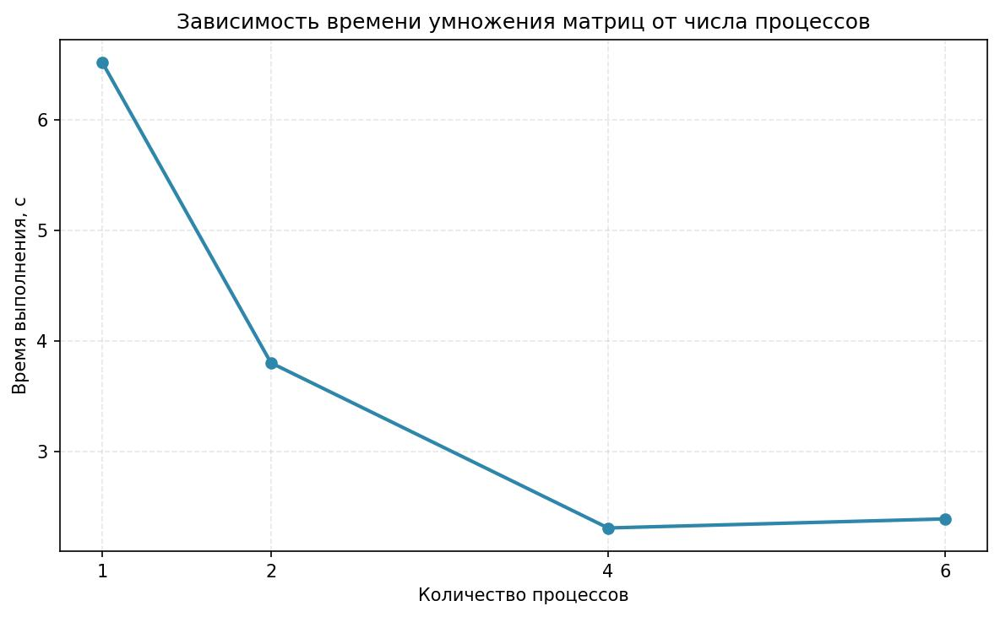

# Лабораторная работа №3: Параллельное умножение матриц с использованием MPI

## Информация о выполнившем

**Выполнил:** Студент группы 6214-100503D ФИ Иванов Влад

## Цель работы

Модифицировать программу умножения матриц для параллельной работы по технологии MPI и исследовать зависимость времени выполнения от количества потоков и размера матриц.

## Задание

Модифицировать программу из л/р №1 для параллельной работы по технологии MPI. Провести серию экспериментов с:

- Разными размерами матриц (примерно 200, 400, 800, 1200, 1600, 2000)
- Разным количеством вычислительных ядер (1, 2, 4, 8 и т.д.)

## Ход работы

Была модифицирована часть умножения матриц по технологии MPI. Была добавлена часть для проведения исследования с разным количеством потоков.

Результаты исследования сохранены в файлах:

- `mpi_benchmark` - исходные данные статистики
- Графики визуализации: `res_100`, `res_200`, `res_500`, `res_1000`, `res_2000`

## Результаты экспериментов

### Графики зависимости времени выполнения от количества потоков

#### Размер матрицы 100×100

#### Размер матрицы 200×200

#### Размер матрицы 500×500

#### Размер матрицы 1000×1000

#### Размер матрицы 2000×2000

### Анализ полученных данных:

- **Размеры матриц (≤500):** Параллелизация очень эффективна.
- **Большие размеры (≥1000):** Эффективность падает после (у меня 4) кол-ва ядер 

## Выводы

### Зависимость эффективности от размера задачи

- Технология MPI довольна эффективна до определенного момента. Пока размеры матриц не превышают определенный порог все идет хорошо, но чем больше размер, тем меньше эффективность обрабатки от большого кол-ва ядер. Происходит незначительный пророст или уменьшение произодительности (после 2000 уменьшение скорее всего будт значительным).

## P.S

- exe файл походу отдельно не работает, но сам код рабочий. В Visual Studio MPI подключал по гайду из https://kpfu.ru/portal/docs/F_838384873/MPI_v_srede_VS.pdf. Запускал через команду "mpiexec -n 4 lab3.exe" в папке с exe файлом. 